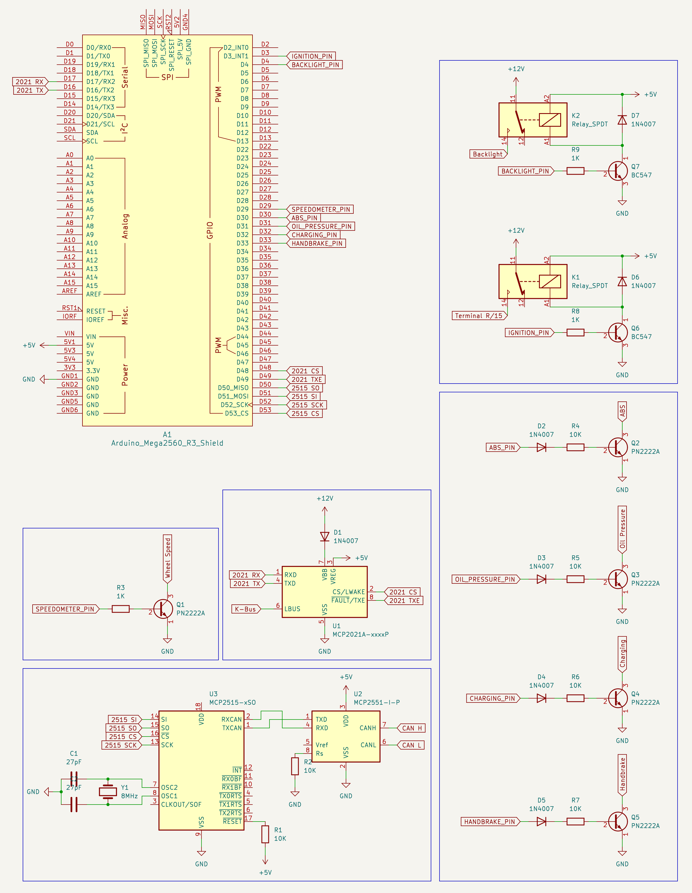

## BMW E46 Cluster Telemetry Receiver

## Supported games
- Euro Truck Simulator 2
- Assetto Corsa

## Supported feautres
- ABS/Traction Control
- RPM
- Engine temperature
- Check engine
- Cruise control
- DDE Light
- Coolant overheating
- Backlight
- Charging
- Handbrake
- Ignition
- Oil Pressure
- Speed
- Indicators
- High beams
- Fog lights
- Time

## TODO
- Fuel
- Consumption

## Wiring
My wiring is a bit complicated beacuse it's a part of a bigger project. You can easily change some parts to ready made like relay drivers or CAN module.

## Installation
- Clone this repository
- Open project as PlatformIO project
- Upload code to board
- Install Truck Simulator Plugin in SimHub (Required for hazard lights and check engine light)
- Select board in SimHub as custom serial device (You must enable this plugin in settings first), set baudrate to 115200 and paste selected protocol

## Video
Coming soong

## Credits
- [MS4x Wiki](https://www.ms4x.net/index.php?title=Siemens_MS43_CAN_Bus) for CAN messages
- [wilhelm-docs](https://github.com/piersholt/wilhelm-docs) for K-Bus documentation

## Check out my other projects
- [BMW E87 Cluster](https://github.com/TeksuSiK/e87-cluster-simhub)
- [BMW F-Series Gear Lever](https://github.com/TeksuSiK/bmw-gws-simhub)
